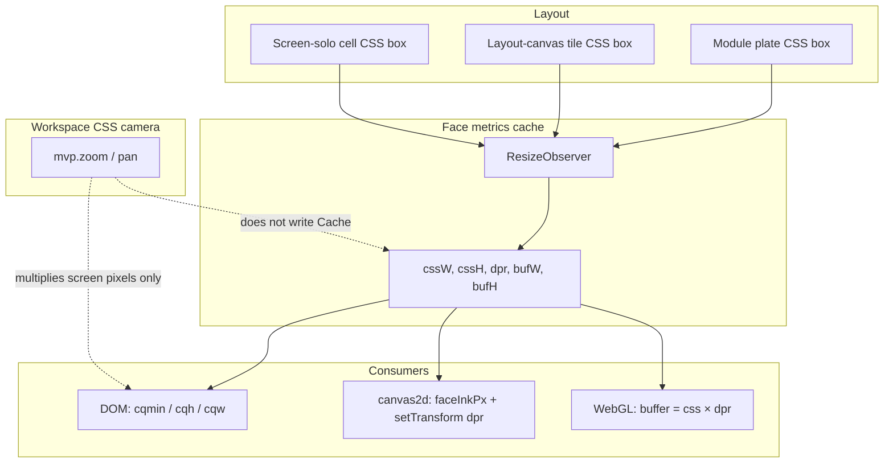
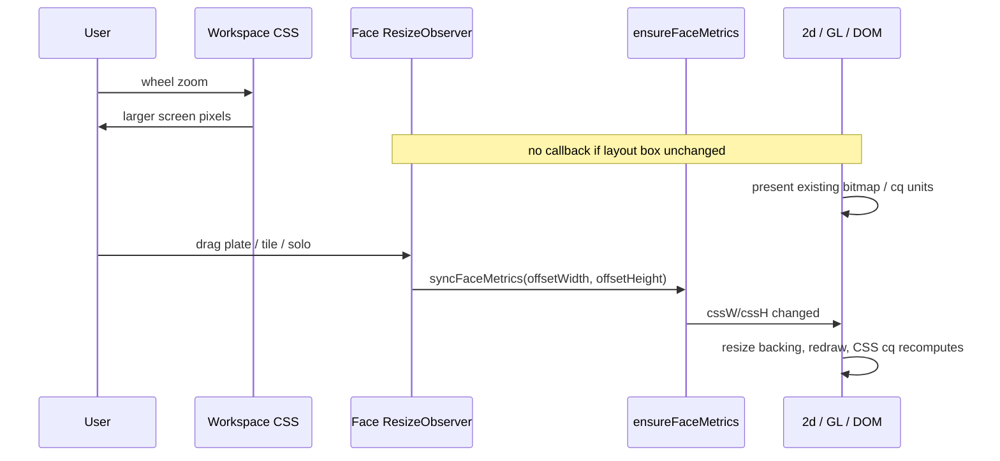
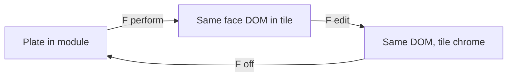

# Display size vs workspace zoom — one scale system

| Field | Value |
|--------|--------|
| **Project** | soemdsp-sandbox |
| **Author** | (draft) |
| **Date** | 2026-09-25 |
| **Status** | Draft |
| **Type** | App-wide architecture rewrite (not incremental FitCaption / ink patches) |
| **Related** | `docs/APP_POLICY.md` §15–16, `public/lib/visual/display-scale.js`, `public/lib/visual/display-face-metrics.js` |

---

## Overview

Module **displays** (faces, canvases, layout-canvas tiles, screen solo) currently mix three length stories: (1) CSS camera zoom, (2) layout CSS box of the face, (3) sticky inline `font-size` / radius px measured from `clientWidth`. Agents keep “fixing” the wrong layer — resizing WebGL buffers on zoom, freezing `lineWidth` at 1.5 CSS px, or retrying FitCaption after F-cycle reparent. Policy §15 recently oscillated between “ink is CSS px, do not × min(face)” and `displayInkToPx(minSide/96)` at paint.

This rewrite defines **one face-size contract** for DOM, canvas2d, and WebGL:

- The **only size signal** is the face’s **layout CSS box** (`offsetWidth` / `offsetHeight`, cached). Never `getBoundingClientRect` for draw scale (that includes workspace zoom).
- **Workspace zoom is a CSS camera.** Existing pixels grow. No redraw, no font rewrite, no GL backing resize.
- **Display size change** (plate resize, layout-canvas tile box, screen solo) is a new canvas. Metrics update → redraw at the new CSS box × `devicePixelRatio`.
- **No sticky inline lengths** derived from a transient box. DOM type / radius / stroke that must follow the face uses **container query units** (`cqmin` / `cqh` / `cqw`), same family as knobs and keypad.
- Authored lengths have **one numeric kind per role**. **Paint** resolves ink with a live layout `minSide` (`metrics.cssW`/`cssH`, never `canvas.width` / never `rect.width`). **Settings normalize** clamps the authored number and **must not** call the paint resolver. Treating `value < 1` as a fraction is unrepresentable.

Phosphor, Instant Trace, and waterfall already follow zoom-pixelates. This plan **does not tour those drawers to “fix scaling.”** First-class consumers: toggle/momentary captions, filter/EQ strokes, then remaining DOM faces.

---

## Background & Motivation

### Current state (what exists)

| Piece | Role today |
|--------|------------|
| `docs/APP_POLICY.md` §15 | Two stored kinds: **ink** (CSS px at `DISPLAY_INK_REFERENCE_PX` = 96) and **layout fraction** (0…1 of min-edge). Zoom is CSS camera. Paint must not force layout every frame. |
| `public/lib/visual/display-scale.js` | `displayInkToPx(px, fallback, faceMinSide)`, `displayScaleToPx(unit01, faceMinSide)`, `DISPLAY_INK_REFERENCE_PX = 96`. |
| `public/lib/visual/display-face-metrics.js` | WeakMap cache `{ cssW, cssH, dpr, width, height }`. `syncFaceMetrics` from ResizeObserver; `ensureFaceMetrics` on paint (cache hit, cold sync once). |
| `public/lib/visual/display-layer-compositor.js` | Documents: pass layout sizes, never `getBoundingClientRect`. |
| Knob faces | `cqmin` for label/value; `nodeGraphKnobFaceSyncCellVar` **clears** `--knob-cell` / `--knob-face-min` so canvas tile px cannot stick on the plate (`knob-face.js`, `node-graph-layout-canvas.js` ~429–431). |
| Plugin buttons | Face is `container-type: size; container-name: pluginbtn`. Stroke already `8cqmin`. Caption still **JS FitCaption** writing `fit.style.fontSize` px. |
| F cycle | `public/node-graph-layout-canvas.js` reparents the **same face DOM** into tiles. Screen solo restore: `public/node-graph-screen-solo.js`. |

### Pain points (do not design more of this)

1. **`nodeGraphPluginButtonFitCaption`** (`plugin-button-settings.js`): measures `offsetWidth`, writes inline `font-size` px, ResizeObserver on face, **24 rAF retries** if box &lt; 8 px, fit keys, `nodeGraphPluginButtonRefitConnectedFaces` from layout-canvas **and** screen-solo. F reparent fires observer at 0×0 or tile size; px **sticks** after F→F even when the plate box did not change.
2. **Radius** is also baked: `btn.style.setProperty("--plugin-btn-radius", \`${radiusPx}px\`)` from `min(faceW, faceH)` while CSS already has `border-radius: var(--plugin-btn-radius, 14cqmin)`.
3. **`displayInkToPx` optional `faceMinSide` conflates store and paint.** Omit it → returns authored px **unscaled** (intentional for **settings clamp**). Pass it → `authored * minSide/96`. Agents cannot tell which is policy.
   - **Store-time (two-arg is correct today):** `normalizeNodeGraphPhaserFaceDisplaySettings` in `node-graph-cookbook-filter.js` ~1098–1101 (`displayInkToPx(bar, defaults.barThickness)`); `normalizeNodeGraphHarmonicLinesSettings` in `harmonic-lines-display.js` ~14 (`displayInkToPx(raw, 2)`); phosphor waveform clamp helpers in `node-graph-phosphor-waveform.js` ~121–150. **Do not pass `faceMin` here** — that double-scales stored thickness.
   - **Paint-time (two-arg is a hairline bug):** `trace-stroke.js` `draw` ~432–433 computes `face` from `options.faceMinSide` then calls `displayInkToPx(options.size, 0)` **without** passing `face`; `trace-history-draw.js` ~91, 160. Phaser **paint** (~1163–1340) and harmonic paint (~288–298) already pass `faceMin` for some widths.
4. **Naming lie**: phosphor `size01ToDiameterPx` / `options.size01` still call `displayInkToPx` (reference-px ink, not 0…1).
5. **Policy pendulum**: “do not × min(face)” produced filter/EQ hairlines (`node-graph-cookbook-filter.js` `strokeCurve = displayInkToPx(1.5, 1.5, faceMin)` is the correct paint path; freezing 1.5 in CSS px is the bug).

Correct diagnosis: sticky writers + dual APIs. Wrong architecture: more gates, retries, and per-host refit hooks.

---

## Goals & Non-Goals

### Goals

- One **FaceScale** module as the only place that converts authored numbers → draw pixels.
- One **metrics** owner: layout CSS box, written only from ResizeObserver / settings / explicit sync.
- Zoom never invalidates backing stores or DOM type.
- Display-box change always does.
- F-cycle is **not a special case**: nothing writes px from a transient `clientWidth`.
- DOM captions: fill-the-button then shrink-to-word; **`textScale` is a font-size multiplier**, not `transform: scale`. Module title labels (`.node-plugin-button-label`) follow the same rule for `labelScale` (in-scope for PR2).
- Policy text such that “resize GL on zoom” and “constant 1.5 px ink” are **checklist No**.
- Incremental PRs; phosphor/trace not rewritten “to scale.”

### Non-Goals

- Touring phosphor, Instant Trace, waterfall, Music Player drawers to change zoom behavior (already CSS camera).
- Migrating all Canvas2D faces to WebGL (still §16 preference, out of this rewrite).
- Perfect CSS `text-fit` for every script; Latin / ASCII plugin captions are the contract.
- Changing workspace pan/zoom camera math (`node-graph-camera-view.js`).
- Feature-completeness of every remaining DOM face in PR1.

---

## Key Decisions

1. **Layout CSS box is the only size signal.** `offsetWidth` / `offsetHeight` (and the metrics cache). **`minSide` is `min(metrics.cssW, metrics.cssH)` (layout CSS px).** Never `canvas.width` (that is CSS × dpr) and never `rect.width` (that is zoomed screen px). `getBoundingClientRect` is allowed only as a **last-resort fallback inside `measureFaceCssBox`**, divided by `nodeGraphMvp.zoom` — never in paint, never as FitCaption input, never copied into drawers as `minSide`.

2. **Zoom ≠ resize.** Zoom: CSS transform on the workspace; bitmaps and `cqmin` stay in layout space; pixels enlarge on screen. Resize: `cssW`/`cssH` change → `syncFaceMetrics` → GL/2d backing `round(css × dpr)` → one redraw.

3. **Authored ink is representation B: CSS px at reference min-edge 96.** Defended: existing Display Settings already store `1.5`, `2`, `11`; defaults in §15; filter/EQ already look right when `displayInkToPx(..., faceMin)` is used. Representation A (0…1 of min-edge) is **only** for compositional box fractions (pad left/right as % of width). **No third system.** No `if (x < 1) treat as fraction`. Phosphor `size01` is renamed in API comments to ink-at-96 (value stays numeric; name stops lying).

4. **Two functions, two jobs.** `clampAuthoredInkPx(authored)` (or two-arg `displayInkToPx` until PR6) for **normalize/store only**. `faceInkPx(authored, minSide)` for **paint only**; `minSide` required. Do **not** change two-arg `displayInkToPx` semantics in PR1 (that zeros phaser stored thickness, harmonic `lineWidth`, and Instant Trace vector size). Grep allowlist: two-arg only in `normalize*` / settings clamp, never in `draw`/`paint`.

5. **DOM lengths that follow the face are CSS container units, never inline px.** Pattern: knobs (`cqmin`), keypad (`calc(var(--node-keypad-text-size) * min(100cqw, 100cqh))`), latch-button (CSS-owned font; JS only **clears** leftover inline size). Plugin captions move to this family. `textScale` multiplies the `font-size` expression.

6. **Caption fit is content-keyed, not box-keyed.** Character count / a `--plugin-btn-chars` custom property may update when **caption text** changes. Resize and F-cycle must not run JS that writes `font-size`.

7. **Who may measure:** only `syncFaceMetrics` / `ensureFaceMetricsObserver` (and a documented settings-apply path that calls `syncFaceMetrics`). Paint, drawers, Fit-replacements **read the cache**. New faces opt in by `container-type: size` + `ensureFaceMetrics` + `faceInkPx`.

8. **Delete FitCaption rather than harden it.** Remove schedule/retry/refit-from-canvas/solo. Layout-canvas must not grow a list of per-widget refit hooks (`nodeGraphPluginButtonRefitConnectedFaces` goes away).

9. **dpr is backing store only.** Authored “1 px” is 1 CSS px **at a 96 px min-edge**, then × `minSide/96`, then canvas `setTransform(dpr)` or GL buffer × dpr. Do not × zoom.

10. **F-cycle reparent is identity** unless the face’s layout CSS box actually changed. Sticky inline px is how F→F looks like a size change today.

---

## Proposed Design

### Conceptual model



### Size vs zoom sequence



### Single module: FaceScale

**Lives in** `public/lib/visual/display-scale.js` (keep path; tighten API). Optional later rename to `face-scale.js` only if all call sites move in one PR — prefer **same file, stricter functions** to avoid dual-load.

```js
// Canonical constants — do not fork
const FACE_INK_REF_PX = 96; // == DISPLAY_INK_REFERENCE_PX (alias kept until PR6)

function faceMinSide(cssW, cssH) { /* min, finite, >= 0 */ }
// alias: displayFaceMinSide → faceMinSide until PR6
// clampDisplayUnit01 stays (frac clamp)

/** Store/clamp only. Never × geometry. */
function clampAuthoredInkPx(authoredPx, fallback = 0) { /* finite ≥ 0 */ }

/** Paint only. minSide = min(metrics.cssW, metrics.cssH). Required. */
function faceInkPx(authoredPx, minSide) {
  const a = finiteNonNeg(authoredPx);
  const s = Number(minSide);
  if (!(s > 0)) return 0; // missing geometry at paint — not a store path
  return a * (s / FACE_INK_REF_PX);
}

/** Box fraction: 0…1 of min-edge. Reject values outside [0,1] in dev. */
function faceFracPx(unit01, minSide) {
  return clamp01(unit01) * positive(minSide);
}
```

Header comment on `display-scale.js` (PR1): **`minSide` is `metrics.cssW/cssH` (layout), never `canvas.width` (dpr) and never `rect.width` (zoom).** Same sentence in the PR1 commit body. Keep compositor `resize` comment.

**Do not change two-arg `displayInkToPx` in PR1.** Until PR6:

- `displayInkToPx(px, fallback)` / omit `faceMinSide` → **unscaled authored** (settings normalize).
- `displayInkToPx(px, fallback, minSide)` when `minSide > 0` → paint scale (existing).
- New paint sites call `faceInkPx` only.

**Delete only in PR6:** `displayInkToPx` name, dual `displayFaceMinSide` / `faceMinSide`.

**Never:** `if (value < 1) value *= minSide`.

Settings UI continues to show “1.5 px @ 96” for ink steppers and “0.06 of min-edge” for stroke-scale-as-fraction where the control is already 0…1 (plugin `--plugin-btn-stroke-scale`). **Patch JSON is identity** — do not convert stored ink numbers. Only **paint** call sites gain `minSide`. Normalize switches to `clampAuthoredInkPx` (or stays two-arg `displayInkToPx`) **without** changing stored values. Two-arg normalize is correct; it must not gain `faceMin`.

### Who measures vs who reads

| Actor | Allowed |
|--------|---------|
| `syncFaceMetrics(section)` | Measure `offsetWidth`/`offsetHeight`; solo-stage fallback already in `measureFaceCssBox`; cache write. |
| `ensureFaceMetricsObserver` | Observe **the face element** (the container with `container-type: size`). |
| Settings apply / face switch | Call `syncFaceMetrics` then paint once. |
| `ensureFaceMetrics` on paint | **Cache hit: read only.** Cold path / `force` / `dpr` change: **sync once** (`measureFaceCssBox` may use `clientWidth` or rect÷zoom). Matches the existing file comment; not a steady-frame probe. |
| Drawers (`phosphor-drawer`, `trace-stroke`, cookbook filter) | Read `metrics.cssW/cssH` or canvas CSS size already synced; `faceInkPx(setting, minSide)`. |
| Plugin / knob / keypad CSS | No JS measure for type. |
| **Forbidden on steady paint rAF** (after cache fill) | `clientWidth`, `getBoundingClientRect`, `fit.style.fontSize = …px`. Cold-sync-once is allowed. |

Keep `measureFaceCssBox` solo fallback (`#nodeScreenSoloStage` / `--node-screen-solo-cols`) — that is layout, not zoom.

Tighten the getBoundingClientRect fallback: it must remain **÷ zoom** and **layout-sync only**. Add a comment + policy checklist item: “do not copy this into drawers.”

### Display size change → redraw

When `cssW`/`cssH` (rounded) change vs last cache:

1. Write cache (`syncFaceMetrics`).
2. Resize canvas/GL: `width = round(cssW * dpr)` (existing compositor `resize`).
3. Existing face paint / dirty bits run on the next frame (module `_needsPaint`, compositor invalidation, phosphor step already bound to the face). **No new `facesizechange` DOM event. No global subscriber list.** That would become another FitCaption hook list.

If a first-class 2d consumer misses redraw after box change, name **that face’s** existing dirty flag in its PR — do not invent a bus.

DOM faces need no event: container queries recompute.

### DOM contract (captions, radius, stroke)

**Plugin toggle/momentary** (`styles.css` `.node-plugin-toggle-face`, `.btn-fit`):

**Single size container:** the face already has `container-type: size; container-name: pluginbtn`. **Do not add `container-type` on the button.** Nested size containers would make `cqmin` on the button (stroke `8cqmin`, radius) follow the **padded button box**, shrinking stroke vs today. Caption *should* follow the padded box; stroke/radius *should* follow the **face**.

| Property | Container | Formula |
|----------|-----------|---------|
| Stroke | face `pluginbtn` | keep `calc(var(--plugin-btn-stroke-scale, 0.06) * 8cqmin)` |
| Radius | face `pluginbtn` | `calc(var(--plugin-btn-rounding, 0.18) * 50cqmin)` — `rounding` default is **0.18** (`plugin-button-settings.js` ~58–59: 0…1 of half min-edge). Today’s JS is `round(s.rounding * 0.5 * min(faceW,faceH))` = `rounding * 50cqmin` of the **face**. CSS fallback `14cqmin` is **wrong** vs 0.18×50 = 9cqmin; drop `--plugin-btn-radius` px. |
| Caption `.btn-fit` | face `pluginbtn` | pads subtracted in the formula (FitCaption used face minus pads). `textScale` multiplies **font-size**. |
| Module title `.node-plugin-button-label` | face `pluginbtn` | **HUD ink**, not FitCaption/fill: `12cqmin` ≈ 12px @ 96 min-edge (same order as filter `titlePx` 12). `labelScale` multiplies that font-size. Do **not** copy the `.btn-fit` chars/glyph formula onto the module name unless product asks. Drop `font-size: 1px`, `text-fit: grow`, `transform: scale(labelScale)`. Mid/center: add `translate` now that scale is gone (today `top: 50%` assumed a 1px grown glyph). |

Replace FitCaption with (face container, no nested CQ):

```css
.btn-fit {
  font-size: calc(
    var(--plugin-btn-text-scale, 1) *
    min(
      calc((1 - var(--plugin-btn-pad-top, 0) - var(--plugin-btn-pad-bottom, 0)) * 100cqh),
      calc(
        (1 - var(--plugin-btn-pad-left, 0) - var(--plugin-btn-pad-right, 0)) * 100cqw
        / max(var(--plugin-btn-chars, 1), 1)
        / var(--plugin-btn-glyph, 0.62)
      )
    )
  );
  line-height: 1;
  /* no transform; textScale is in font-size */
}
.node-plugin-toggle-button,
.node-plugin-momentary-button {
  border-radius: calc(var(--plugin-btn-rounding, 0.18) * 50cqmin);
  /* stroke stays 8cqmin of pluginbtn (face) */
}
.node-plugin-button-label {
  font-size: calc(var(--plugin-label-scale, 1) * 12cqmin); /* HUD ink, 12px @ 96 */
  transform: none;
  text-fit: none;
}
/* Mid/center rows: add translate(-50%/-50%) as needed now that transform:scale is gone. */
```

- `--plugin-btn-text-scale` / pads already set in `nodeGraphPluginButtonPaintFace`.
- `--plugin-btn-chars` set **only when caption string changes** (Off/On/Gate / custom), not on resize. `String.length` ≠ visual width (`Off` vs `WW`); clipping vs canvas `measureText` is **accepted**. Optional later: `ch` if the UI font is roughly tabular — not required for PR2.
- `--plugin-btn-glyph` ~0.62 (700-weight UI sans). Tune once; not a Display Settings control (`textScale` already exists).
- Border is `border-box` on the button; caption uses **face × (1−pads)**, not minus stroke. Slight inset vs FitCaption’s inner content box is accepted.

Fill-then-shrink: `min(padded cqh, width-limited)` — keypad pattern (`keypad-ui.css` line 87), not experimental `text-fit` (user undid that path).

**PR2 visual acceptance (must run):** Off / On / Gate at default pads; max-length caption (~12–32 chars); pads 0.2 each side; pill vs squircle; zoom 0.25 and 4 (**no caption reflow**); F-cycle plate→tile **same CSS box** → same type size; tile grow → type follows tile; restore plate → plate size not tile size.

**JS leftover:** `nodeGraphPluginButtonFitCaption` becomes a **clearInlineFontSize** (latch-button pattern in `public/latch-button.js` `clearInlineLabelSize`). Remove `ScheduleFitCaption`, 24 retries, `_pluginBtnFitKey`, `RefitConnectedFaces`, ResizeObserver in `WatchCaption`.

**Layout-canvas** (`node-graph-layout-canvas.js` ~452–454): delete **only** `nodeGraphPluginButtonRefitConnectedFaces`. Do **not** delete `relayoutKeyboardFaces`. MIDI keyboard apply/render and knob `SyncCellVar` (clearer, not publisher — `knob-face.js` ~528–535) stay.

**Screen-solo** (`node-graph-screen-solo.js` ~665): delete FitCaption on restore.

### Canvas2d / WebGL contract

Paint:

```js
const m = ensureFaceMetrics(section); // cache
const minSide = faceMinSide(m.cssW, m.cssH);
ctx.setTransform(m.dpr, 0, 0, m.dpr, 0, 0);
ctx.lineWidth = faceInkPx(view.curveThickness, minSide); // e.g. 1.5 → 1.5 * minSide/96
```

Filter/EQ (`node-graph-cookbook-filter.js` ~1333–1340) already does this once `faceMin` is passed — **keep**, stop any “constant CSS px” revert.

WebGL: compositor `resize(cssW, cssH, dpr)` already uses layout sizes. Zoom must not call `resize` with `getBoundingClientRect`. Audit remaining `getBoundingClientRect` in **face paint** in PR5 (inventory below — not only `arp-display.js`); do not treat them as zoom-scale.

Phosphor/trace: **no functional change** in the zoom path. Optional cleanup: pass `faceMinSide` everywhere `displayInkToPx` is used; rename `size01` comments. Not a “scaling fix” tour.

### F-cycle



Reparent changes parent, not authored settings. If CSS uses `cqmin` relative to the face container, and the face’s **layout box** is unchanged, appearance is unchanged. If the tile assigns a different CSS box, that **is** a display size change → RO → metrics → GL redraw; DOM cq follows. No refit hook list.

Constraint already documented at layout-canvas ~429: **never publish canvas tile px onto the module plate.** Extend to plugin buttons.

### New faces opt-in checklist

1. Face root: `container-type: size` if it has DOM ink.
2. `ensureFaceMetricsObserver(face)` at mount.
3. Paint: `ensureFaceMetrics` + `faceInkPx` / `faceFracPx`.
4. No inline `font-size`/`width` from `clientWidth`.
5. Settings: ink steppers store px-at-96; pads store 0…1.

---

## API / Interface Changes

### `display-scale.js`

| Symbol | Until PR6 | After PR6 |
|--------|-----------|-----------|
| `DISPLAY_INK_REFERENCE_PX` | keep | alias of `FACE_INK_REF_PX` or rename |
| `displayFaceMinSide` | keep; `faceMinSide` added as alias | one name `faceMinSide` |
| `clampDisplayUnit01` | keep | keep (frac clamp) |
| `displayScaleToPx` | alias of `faceFracPx` | `faceFracPx` |
| `displayInkToPx(px, fb)` two-arg | **unchanged**: unscaled authored (normalize only) | deleted; use `clampAuthoredInkPx` |
| `displayInkToPx(px, fb, minSide)` | **unchanged** when minSide > 0 | deleted; use `faceInkPx` |
| `faceInkPx(authored, minSide)` | **new**, paint only, minSide required | canonical paint |
| `clampAuthoredInkPx` | **new** or two-arg displayInkToPx | canonical store |

Grep allowlist until PR3/PR6: two-arg `displayInkToPx` only in `normalize*` / settings clamp. Paint omit (`trace-stroke.js` `draw`, `trace-history-draw.js`) is PR3 work — **do not** make two-arg return 0 in PR1.

### Plugin button JS

| Remove | Replace with |
|--------|----------------|
| `nodeGraphPluginButtonFitCaption` measure + write | `nodeGraphPluginButtonClearCaptionInlineSize` |
| `ScheduleFitCaption` (24 rAF) | deleted |
| `RefitConnectedFaces` | deleted |
| `WatchCaption` ResizeObserver | deleted (CSS) |
| `--plugin-btn-radius` px | `--plugin-btn-rounding` 0…1 (default **0.18**) × `50cqmin` of face `pluginbtn` |
| `--plugin-btn-chars` | set on label text change only |

### Policy §15–16

Rewrite so the wrong thing is unrepresentable. See **Policy rewrite** below (normative text to paste).

---

## Data Model Changes

**Patch JSON:** no migration of stored numbers. Ink keys stay `1.5` meaning “1.5 CSS px at 96 min-edge.” Layout pads stay 0…1.

**In-memory:** stop dual interpretation. Settings normalize: `clampAuthoredInkPx` / two-arg `displayInkToPx` only (no geometry). Clamp frac to [0,1]; **never** auto-detect by magnitude. **Never** pass `faceMin` into normalize (double-scale).

**DOM dataset:** optional `--plugin-btn-chars` is not persisted; derived from caption string.

---

## Alternatives Considered

### 1. Keep FitCaption, add more guards

Skip if &lt;8 px, fit keys, rAF retries, refit from layout-canvas and screen-solo. **Rejected.** User: overly complicated. Root cause is sticky px, not missing retries. F-cycle will keep inventing 0-size frames.

### 2. CSS `text-fit` + `transform: scale(textScale)` + radius `cqmin`

Tried; user undid: broke toggle text scaling. `textScale` must be a **size multiplier in `font-size`**, not a post-transform (transforms do not change used font metrics / stroke coupling the same way). **Rejected as the caption engine.** `cqmin` for radius/stroke stays.

### 3. Representation A only (everything 0…1 of min-edge)

Would force Display Settings to show “0.0156 of min-edge” instead of “1.5 px”, and migrate every stored `1.5` / `11`. High churn, easy to get 96× wrong. **Rejected for ink.** Keep 0…1 only for pads/insets.

### 4. Representation B only (everything px-at-96), including pads

Plugin pads are **per-edge fractions of width/height** (not min-edge ink). Mapping pad-left through 96 would be the wrong geometry. **Rejected for pads.**

### 5. Measure once into CSS variables on RO (`--face-min: 140px`)

Knobs already **forbid** publishing `--knob-cell` onto shared face DOM because layout-canvas reparent leaks tile size onto the plate. Same trap. **Rejected.** Use cq units (live container) not copied px vars.

### 6. Nested `container-type` on the button + caption `100cqh`

Would size captions to the padded button (good) but steal the nearest size container from stroke/radius `cqmin` (bad — stroke follows padded box). **Rejected.** Keep **one** container: named face `pluginbtn`. Caption uses `cqw`/`cqh` of `pluginbtn` minus pads: `calc((1 - padL - padR) * 100cqw)`. Stroke/radius stay face `cqmin`.

---

## Security & Privacy Considerations

No new network, auth, or user-data surfaces. Face metrics are local DOM sizes. Canvas `measureText` (if any leftover) does not leave the renderer. No change to patch encryption or WASM boundary.

**Threat / footgun:** a future agent copies `getBoundingClientRect` into a GL `resize` → zoom allocates huge buffers (GPU memory). Mitigation: policy checklist + compositor comment + grep in PR review.

---

## Observability

- **Dev assert** (debug build / `?debug=`): `faceInkPx` without finite `minSide` (paint API only — not two-arg `displayInkToPx`). Optional: warn two-arg `displayInkToPx` outside `normalize*`. Do not ship a Proxy on Element.
- **Grep CI / review checklist:** `FitCaption`, `fit.style.fontSize`, two-arg `displayInkToPx` **outside** normalize/clamp, `getBoundingClientRect` under `public/modules/**` paint/backing paths.
- **Manual:** (1) zoom graph — phosphor/trace pixelate, captions do not reflow; (2) resize filter face — strokes thicken; (3) F, F, F — toggle caption size matches plate; (4) layout-canvas tile grow — caption and GL follow tile; restore plate — plate size, not tile size.

No production metrics required; this is a UI scale contract.

---

## Rollout Plan

Feature flags: **none.** Pre-feature-complete; one path (`APP_POLICY` “delete over compatibility”).

Order: add FaceScale + policy **without** changing two-arg ink → plugin DOM (delete FitCaption) → paint omit-minSide sweep (trace `draw`, etc.) **then** debug-assert two-arg paint is empty → filter/EQ confirm → `getBoundingClientRect` inventory. Phosphor/trace: thread `minSide` in paint only; do not change zoom/backing.

**Rollback:** revert the PR; do not keep FitCaption “just in case” beside CSS.

---

## Risks

| Risk | Severity | Mitigation |
|------|----------|------------|
| CSS `min(100cqh, 100cqw/chars/glyph)` looks worse than canvas measure for odd fonts | Medium | Tune `--plugin-btn-glyph`; chars from string length; accept Latin UI labels as spec |
| `faceInkPx` missing side returns 0 → invisible strokes | Low | **Paint API only.** Cold `ensureFaceMetrics` still measures once, so first paint usually has `cssW`. Do **not** make two-arg `displayInkToPx` return 0 (that blanks live drawers). |
| Dual `displayInkToPx` / `faceInkPx` during migration | Medium | Same file; two-arg store semantics **unchanged** until PR6; new paint uses `faceInkPx`; delete alias after paint grep clean |
| Agent still “fixes zoom” in a drawer | High (process) | Policy checklist Nos; do not assign phosphor “scale” tickets |
| Container queries on reparented nodes lag one frame | Low | Accept one frame; no rAF retry writer |

---

## Policy rewrite (normative, replace §15–16 length rules)

Paste into `docs/APP_POLICY.md` (replace the oscillating paragraphs). Intent: **wrong fixes become checklist No.**

**Display vs zoom (hard):**

- A **display** is one scaled object. Changing the face’s **layout CSS box** (plate, layout-canvas tile, screen solo) scales type, strokes, pads, radius, and GL/2d resolution together (`min(cssW,cssH)`).
- **Workspace zoom is not a resize.** Zoom pixelates. Do **not** redraw phosphor / trace / waterfall / WebGL at a higher backing size because the user zoomed. Do **not** rewrite `font-size` on zoom.
- **Display size change is not a zoom.** New CSS box → `syncFaceMetrics` → resize backing `css × dpr` → redraw.
- **F-cycle reparent** is not a size change unless the layout CSS box changed. Do not write inline px from `clientWidth`.
- **Measure:** layout box (`offsetWidth` / cache). Never `getBoundingClientRect` for draw scale.
- **`minSide` is `metrics.cssW/cssH` (layout), never `canvas.width` (dpr) and never `rect.width` (zoom).**
- **Ink store:** CSS px at `DISPLAY_INK_REFERENCE_PX` (96). **Normalize/clamp** the authored number with **no geometry**. **Paint** only: `px * minSide / 96`. **Layout fraction store:** 0…1 of min-edge (pads/insets). **No** `if value < 1 treat as fraction`. **No** passing `faceMin` into `normalize*`. **No** omitting `minSide` **in paint** (hairlines). Two-arg helper is store-only until deleted.
- **DOM:** container query units (`cqmin` / `cqh` / `cqw`). `textScale` multiplies `font-size`, not `transform`. JS may clear leftover inline sizes; it may not bake px.
- **Paint vs layout:** no `clientWidth` / geometry style writes on the steady rAF. ResizeObserver owns chrome and backing size.

**Checklist additions:**

| Idea | Usually |
|------|---------|
| Resize WebGL / canvas buffer because workspace zoomed | **No** |
| Draw filter/EQ strokes as constant 1–1.5 CSS px at every face size | **No** |
| `displayInkToPx(x, fb)` without `minSide` **in paint/draw** | **No** — store/normalize only |
| Pass `getBoundingClientRect().width` or `canvas.width` as `minSide` | **No** — layout `metrics.cssW/cssH` |
| Inline `font-size` px from `clientWidth` (FitCaption) | **No** |
| rAF retries / refit hooks from layout-canvas or screen-solo for captions | **No** |
| `transform: scale(textScale)` instead of larger font | **No** |
| Publish tile-measured px vars onto shared face DOM | **No** |
| Store ink as 0…1 of min-edge | **No** — px at 96 |
| Store pad/inset as CSS px | **No** — 0…1 |

---

## Organization (where code lives)

```
public/lib/visual/display-scale.js      # FaceScale: faceInkPx, faceFracPx, FACE_INK_REF_PX
public/lib/visual/display-face-metrics.js  # only measurer + cache
public/lib/visual/display-layer-compositor.js  # GL/2d backing from cssW/cssH × dpr
public/styles.css                       # pluginbtn container; btn-fit cq formula
public/modules/plugin/plugin-button-settings.js  # settings + CSS vars; no FitCaption
public/modules/knob/knob-face.js        # existing cqmin; keep SyncCellVar as clearer
public/node-graph-layout-canvas.js      # reparent; no caption refit
public/node-graph-screen-solo.js        # restore; no caption refit
docs/APP_POLICY.md §15–16               # law
```

New faces: do not add `public/lib/visual/fit-caption.js`.

---

## Open Questions

1. **`--plugin-btn-glyph` (0.62)** — lock after one visual pass on Off/On/Gate and long custom captions, or expose in Display Settings? Recommendation: lock constant; settings already have `textScale`.
2. **CJK / very long captions** — wrap vs shrink? Product today is `white-space: nowrap`. Keep nowrap unless product asks.
3. **When to delete `displayInkToPx` name** — **PR6**, after paint two-arg grep is empty. Do **not** assert-zero two-arg in PR1.
4. **PR5 rect inventory** — paint/backing vs pointer; see PR5 table (`xy-pad-ui.js` is the zoom-buffer cousin, not only arp).

---

## References

- `docs/APP_POLICY.md` §15–16, checklist rows on ink / zoom / stretch
- `public/lib/visual/display-scale.js` — `DISPLAY_INK_REFERENCE_PX`, `displayInkToPx`, `displayScaleToPx`
- `public/lib/visual/display-face-metrics.js` — `measureFaceCssBox`, `syncFaceMetrics`, `ensureFaceMetrics`
- `public/lib/visual/display-layer-compositor.js` — `resize` layout sizes
- `public/node-graph-layout-canvas.js` — F-cycle reparent; knob px leak comment
- `public/node-graph-screen-solo.js` — FitCaption on restore (delete)
- `public/modules/plugin/plugin-button-settings.js` — FitCaption / WatchCaption / radius px
- `public/modules/plugin/plugin-controls-ui.js` — FitCaption after caption text
- `public/styles.css` — `.btn-fit`, `.node-plugin-toggle-face` `pluginbtn` container
- `public/modules/knob/knob-face.js` — `nodeGraphKnobFaceSyncCellVar`, cqmin
- `public/modules/keypad/keypad-ui.css` — `font-size: calc(var(--node-keypad-text-size) * min(100cqw, 100cqh))`
- `public/latch-button.js` — CSS-owned font; JS clears inline size
- `public/node-graph-cookbook-filter.js` — `displayInkToPx(..., faceMin)` strokes
- `public/lib/phosphor/phosphor-drawer.js`, `public/lib/trace/trace-stroke.js` — zoom-pixelates; do not tour

---

## PR Plan

### PR 1 — FaceScale contract + policy law (aliases **unchanged**)

- **Title:** Face scale helpers + policy: zoom is camera, display box is size
- **Files:** `public/lib/visual/display-scale.js` (header + new functions), `docs/APP_POLICY.md` §15–16 and checklist
- **Depends on:** none
- **Changes:** Add `faceInkPx` / `faceFracPx` / `clampAuthoredInkPx` / `faceMinSide` (alias of `displayFaceMinSide`). **Do not change two-arg `displayInkToPx`.** Rewrite §15: constant-px ink = No; resize GL on zoom = No; `minSide` = layout metrics, never `canvas.width` / `rect.width`. Commit body repeats that sentence. **No visual face tours; no omit→0.**

### PR 2 — Plugin captions: CSS cq on `pluginbtn`, delete FitCaption

- **Title:** Toggle/momentary captions follow face via cq units; remove FitCaption
- **Files:** `public/styles.css`, `public/modules/plugin/plugin-button-settings.js`, `public/modules/plugin/plugin-controls-ui.js`, `public/node-graph-layout-canvas.js`, `public/node-graph-screen-solo.js`
- **Depends on:** none (parallel with PR1)
- **Changes:** Keep **one** container (`pluginbtn` on the face). Caption `.btn-fit`: `textScale * min(padded 100cqh, padded 100cqw / chars / glyph)`. **No** `container-type` on the button. Radius: `--plugin-btn-rounding` default **0.18** × `50cqmin` of the **face**; stop writing `--plugin-btn-radius` px. Stroke stays face `8cqmin`. **In-scope:** `.node-plugin-button-label` is **HUD ink** (`12cqmin` ≈ 12px @ 96), not fill-the-face; do not copy `.btn-fit` chars/glyph. Drop `text-fit: grow` / `transform: scale(labelScale)`; `labelScale` in `font-size`; mid-align `translate` as needed. Set `--plugin-btn-chars` on text change only. Delete schedule/retry/observer/`RefitConnectedFaces`. **Do not** delete MIDI `relayoutKeyboardFaces` or knob `SyncCellVar`. Clear leftover inline `font-size`. Acceptance: Off/On/Gate; long caption; pads 0.2; pill/squircle; zoom 0.25 & 4 no reflow; F-cycle same box.

### PR 3 — Paint omit-minSide sweep (store paths stay two-arg)

- **Title:** Paint paths pass layout minSide; normalize never scales
- **Files:** **(A) paint omit → thread minSide:** `public/lib/trace/trace-stroke.js` `draw` (~432–433), `public/lib/trace/trace-history-draw.js` ~91, 160. **(B) normalize — do not pass geometry:** `normalizeNodeGraphPhaserFaceDisplaySettings` (`node-graph-cookbook-filter.js` ~1098–1101), `normalizeNodeGraphHarmonicLinesSettings` (`harmonic-lines-display.js` ~14), `node-graph-phosphor-waveform.js` clamp ~121–150. Optional: phosphor `size01` comments.
- **Depends on:** PR 1 (new `faceInkPx` exists; two-arg still unscaled)
- **Changes:** (A) `faceInkPx(options.size, options.faceMinSide || metrics minSide)`. (B) `clampAuthoredInkPx` / two-arg only. **Do not** pass `faceMin` into normalize (double-scale). After (A) is empty, debug-assert two-arg in `draw`/`paint` only. **Do not** change phosphor/trace zoom/backing.

### PR 4 — Filter/EQ and remaining 2d faces stay on FaceScale (no freeze)

- **Title:** Cookbook filter/EQ ink uses faceInkPx only
- **Files:** `public/node-graph-cookbook-filter.js` **paint** (~1163–1340 already passes `faceMin`), additive-filter-curve-display, ensemble-cloud-display, audio-player-playlist strokes as needed
- **Depends on:** PR 1
- **Changes:** Confirm paint always passes `faceMin`; remove any constant `lineWidth = 1.5`. Leave phaser **normalize** two-arg. No FitCaption-style helpers.

### PR 5 — Metrics-only paint: getBoundingClientRect inventory

- **Title:** Face backing/stroke use layout metrics, not zoomed rects
- **Files / inventory:**

  | File | Role | Action |
  |------|------|--------|
  | `public/modules/arp/arp-display.js` | paint/hit mix | backing/stroke → metrics; pointer may keep rect |
  | `public/modules/xyPad/xy-pad-ui.js` ~690–711 | documents zoom trap; fallback rect÷zoom | **must-fix** backing to metrics, or **must-keep ÷zoom** with comment (closest cousin to phosphor zoom-buffer bug) |
  | `public/modules/wallDelay/wall-delay-room-display.js` | audit | split paint vs pointer |
  | `public/modules/sequencer/sequencer-ui.js` | audit | split |
  | `public/modules/gridKeyboard/grid-keyboard.js` | audit | pointer vs backing split |
  | `public/modules/bugButton/bug-button-ui.js` | audit | split |
  | `public/modules/spectrogram/spectrogram-gradient-editor.js` | audit | split |
  | `display-face-metrics.js` | comments | rect÷zoom last resort stays layout-sync only |

- **Depends on:** PR 1
- **Changes:** Hit-testing may still use rects; **backing size and stroke scale must not** use zoomed rects or `canvas.width` as `minSide`. Layout-canvas/solo still call `syncFaceMetrics`, not widget refit lists.

### PR 6 — Delete aliases and dead FitCaption exports

- **Title:** Remove displayInkToPx alias and leftover caption exports
- **Files:** `display-scale.js`, any remaining `nodeGraphPluginButtonFitCaption` globals, docs
- **Depends on:** PR 1–5 (paint two-arg grep empty)
- **Changes:** Canonical names `faceInkPx` / `faceFracPx` / `clampAuthoredInkPx` / `faceMinSide`. `clampDisplayUnit01` stays. Grep clean. Delete-only PR.
