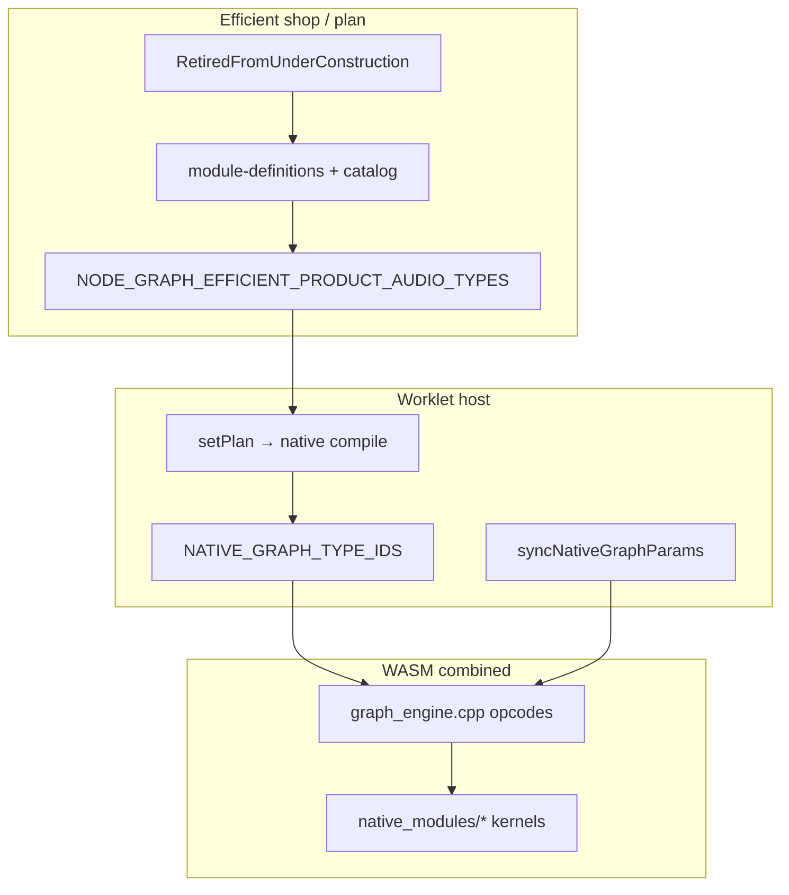
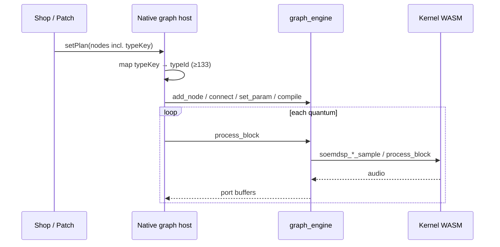

# Efficient-Product Conversion Batch: UC Modules with Fleshed-Out JS DSP

| Field | Value |
|-------|-------|
| **Author** | Sandbox DSP Architecture |
| **Date** | 2026-09-01 |
| **Status** | Approved — pending execute (rev 3; A5b resolved) |
| **Repo** | `C:\Users\argit\Documents\_PROGRAMMING\soemdsp-sandbox` |
| **Policy** | `docs/APP_POLICY.md` §0b (efficient Live = native graph only; no JS audio twin) |
| **Effort envelope** | ~10 PRs / **19 ship targets** (18 CONVERT + 1 FINISH). PR1–4 small (~0.5–1.5d each); PR5–7 medium (~1–2d); **PR8a→8c** musical medium-large; **PR9a/9b** large (multi-day). Rough calendar **2–4 weeks** with limited parallelism on `graph_engine.cpp`. |

---

## Overview

Selected Under-Construction (UC) shop modules already have real JavaScript DSP, but they are parked on the UC shelf and excluded from the Minimum Viable Efficient Product (MVEP) allowlist. This design converts that set onto the efficient surface: native C++/WASM kernels in `native_modules/`, opcodes in `graph_engine`, host mapping in `node-live-audio-worklet-native-graph.js`, allowlist + catalog retirement, and headless smoke coverage.

**Batch size:** **18 CONVERT + 1 FINISH + 3 SKIP** (19 ship targets). Three stubs remain **SKIP** (`arp`, `binaryClock`, `besselThomson`). One module is **FINISH** rather than rewrite: `papoulisFilter` already has `native_modules/papoulis_filter/` (also used as the Control smoother); it needs a graph node opcode + efficient allowlist, not a DSP rewrite. Everything else in the CONVERT set follows the established `eqFilter` / `slewLimiter` checklist.

---

## Background & Motivation

### Current state

- Efficient product SSOT: `public/node-graph-efficient-product.js` → `NODE_GRAPH_EFFICIENT_PRODUCT_AUDIO_TYPES`.
- UC parking list: `nodeGraphModuleCatalogUnderConstructionSort` in `public/node-graph-module-store.js` (includes all CONVERT targets).
- Retired list today is thin: `output`, `audioInput`, `rms`, `additiveLinearFilter`.
- Highest allocated graph type ID: **`kTypeAudioInput = 132`** in `native_modules/graph_engine/graph_engine.cpp` (mirrored in `NATIVE_GRAPH_TYPE_IDS`). Next free ID is **133**.
- Graph WASM version currently returns **99** (`soemdsp_graph_version`).
- Yellow Graph / Additive bus opcodes **111–127** are unrelated to Smooth/Step Graph (`graph2` / `graphCopy`) — do not conflate. (`APP_POLICY.md` §0b still says **111–124**; PRs that edit policy must bump the documented range to **111–127**, not “fix” code down to 124.)
- UC sort also still lists some types that are **already** efficient-allowlisted / natived (e.g. `hypersaw`, `phosphillator`, `humanFilter`, `chaoticPhaseLockingFilter`, `metallicRatio`). Those “UC ghosts” are **out of scope** for this conversion batch (see Non-Goals / PR10).

### Pain points

1. Fleshed-out UC modules are invisible in the efficient shop despite usable DSP.
2. Full-product path still runs JS worklet evaluators; efficient path must refuse foreign types with no JS twin (`APP_POLICY` §0b).
3. Cousins already native+efficient (`chordMemory` 83, `turingMachine` 86, `eqFilter` 57, envelopes 70–72) prove the pattern; the CONVERT set is stranded mid-migration.
4. `papoulisFilter` is an awkward partial: native kernel ships and Control smoothers call it, but there is no `kTypePapoulis*` audio node.

---

## Goals & Non-Goals

### Goals

- Convert every CONVERT-set module to native graph DSP and ship it on the efficient allowlist.
- Finish `papoulisFilter` graph integration without rewriting the Papoulis kernel.
- Retire converted types from UC sort into `RetiredFromUnderConstruction`.
- Preserve face/UI math JS where needed; **do not** wire worklet evaluators into the efficient blob.
- Batch by shared kernels for reviewable PRs; isolate high-risk Graph modules.

### Non-Goals

- Implementing stubs: `arp`, `binaryClock`, `besselThomson` (and do **not** confuse `besselThomson` with already-converted `bessel` = type 54).
- Shipping bare `eqFilter` nodes as stand-ins for Bandpass/Allpass shop types.
- Changing Yellow Graph / Additive **opcodes** 111–127 behavior (policy text may be corrected to match code; see Issue/PR10 note).
- Removing JS evaluators from `?product=full` in this batch (debt can remain until a later peel pass).
- New anti-aliased LFO for `basicShape` (JS is explicitly naive / no AA — native should match).
- Cleaning **pre-existing UC ghosts** of modules that are already on the efficient allowlist / native opcodes (`hypersaw`, `phosphillator`, `humanFilter`, etc.). Track as separate catalog debt; do **not** block CONVERT PRs on that sweep.

---

## Inventory

| Type key | Shop label / role | Action | JS / native source today | Notes |
|----------|-------------------|--------|--------------------------|-------|
| `arp` | Arpeggiator | **SKIP** | UC placeholder zeros | Parked plan text only |
| `binaryClock` | Binary Clock | **SKIP** | UC placeholder zeros | — |
| `besselThomson` | Bessel–Thomson | **SKIP** | UC passthrough | ≠ `bessel` (54, already efficient) |
| `attackDecay` | AD envelope | **CONVERT** | `public/modules/attackDecay/attack-decay-math.js` | Gate/trig/loop/LFO + curve |
| `chordPad` | Chord Pad | **CONVERT** | `public/modules/chordPad/chord-pad-worklet-evaluator.js` | Scale (12-bit mask) / Root / Gate — **not** poly pitch outs |
| `degreePhrase` | Degree Phrase | **CONVERT** | `musicalEngines` + `node-graph-musical-engines.js` | Shared scale helpers |
| `degreeTuring` | Degree Turing | **CONVERT** | same | Cousin of native `turingMachine` |
| `gravityWalker` | Gravity Walker | **CONVERT** | same | Nearest-tone walk |
| `noteGlide` | Note Glide | **CONVERT** | same | Portamento on 0.1V/Oct |
| `noteTranspose` | Note Transpose | **CONVERT** | same | Semitone/octave offset |
| `speakerProtection` | Speaker Protection | **CONVERT** | `speaker-protection-worklet-evaluator.js` | Hard mute if \|x\|>1 / non-finite |
| `speakerProtector2` | Speaker Protector 2 | **CONVERT** | `speaker-protector-2-math.js` | Slew VCA drop/hold/rise + HP trip |
| `basicShape` | BasicShape | **CONVERT** | `public/modules/basicShape/` | Naive multi-wave LFO, no AA |
| `graph2` | Smooth Graph | **CONVERT** | `public/modules/graph/`, `node-graph-graph-utils.js`, `node-live-audio-worklet-graph.js` | Curve LFO/phasor/mapper |
| `graphCopy` | Step Graph | **CONVERT** | same family | Per-segment shapes + hold |
| `allpass` | Allpass Filter | **CONVERT** | JS locks EQ SVF **mode 6** via `eq-filter-math.js` | Distinct type ID; reuse `soemdsp_eq_filter_*` |
| `bandpass` | Bandpass Filter | **CONVERT** | JS locks EQ SVF **mode 4** (BP12 Peak) | Distinct type ID; reuse `soemdsp_eq_filter_*` |
| `tiltFilter` | Tilt Filter | **CONVERT** | `tilt-filter-math.js` | Own 1-pole shelf kernel |
| `phaseDisperse` | Phase Disperse | **CONVERT** | `phase-disperse-math.js` | Cascaded APF ≤64 stages |
| `hilbert` | Hilbert | **CONVERT** | `hilbert-math.js` (uses quadrature net) | Mono In→Out; `shift` ∈ {+90,−90,0} |
| `quadrature` | Hilbert Pair | **CONVERT** | `quadrature-math.js` | In/Mid/Side → I/Q/MidI/SideQ (see I/O contract) |
| `papoulisFilter` | Papoulis Filter | **FINISH** | `native_modules/papoulis_filter/` already built | Graph opcode + allowlist only |

**Counts:** **CONVERT 18 · FINISH 1 · SKIP 3** (= **19 ship targets**). Breakdown: envelope×1 + musical×6 + protection×2 + modulators×3 + scientific CONVERT×6 (`allpass`, `bandpass`, `tiltFilter`, `phaseDisperse`, `hilbert`, `quadrature`) + scientific FINISH×1 (`papoulisFilter`).

### EQ mode reference (confirmed)

From `public/modules/eqFilter/eq-filter-math.js` / `eq_filter.cpp`:

| Mode | Name |
|------|------|
| 0 | Bypass |
| 1 | HP12 |
| 2 | LP12 |
| 3 | BP12 Skirt |
| 4 | **BP12 Peak** ← `bandpass` |
| 5 | BR12 |
| 6 | **AP12** ← `allpass` |
| 7 | Peak |
| 8 | LS12 |
| 9 | HS12 |

JS wrappers in `scientific-iir-worklet-evaluator.js` call `nodeGraphEqFilterSample(..., 4|6, ...)`.

---

## Proposed Design

### Architecture



### Conversion checklist (one module)

Mirror `eqFilter` / `slewLimiter`:

1. **`native_modules/<snake>/<snake>.cpp`** — `soemdsp-native-*` headers; `create` / `destroy` / `sample` (and `process_block` if stereo-heavy).
2. **`scripts/build_native_modules.ps1`** — Exports entry; rebuild combined WASM; run `generate_native_modules_catalog.py`.
3. **`graph_engine.cpp`** — allocate next free `kType*` (≥133); create/destroy/process; MLR stereo path when the face has Left/Right.
4. **`public/node-live-audio-worklet-native-graph.js`** — `NATIVE_GRAPH_TYPE_IDS` + `syncNativeGraphParams` (param IDs: reuse or mint in **200–299**; sync with `graph_engine.cpp` in the same PR).
5. **`public/node-graph-efficient-product.js`** allowlist + **`docs/APP_POLICY.md` §0b** table/commentary (when editing policy, also correct Yellow range **111–127** if still listed as 111–124).
6. **`public/node-graph-module-store.js`** — remove from UC sort; append `RetiredFromUnderConstruction`.
7. **`scripts/smoke_graph_*.mjs`** for the new typeId(s).
8. **Peel rules** — keep face math JS if UI needs it; do **not** register worklet evaluators on the efficient blob path.

### Type ID assignment strategy

- **Monotonic allocation from 133** in `graph_engine.cpp`, kept 1:1 with `NATIVE_GRAPH_TYPE_IDS`.
- Never reuse tombstoned IDs (e.g. former vactrol **74**).
- Never collide with Additive/Yellow **111–127**, portals **130–131**, or `audioInput` **132**.
- Proposed contiguous block (subject to PR merge order — assign at merge time if parallel PRs race):

| ID | Type key | Rationale cluster |
|----|----------|-------------------|
| 133 | `papoulisFilter` | Finish first; kernel already linked |
| 134 | `speakerProtection` | Dynamics / protection |
| 135 | `speakerProtector2` | Dynamics / protection |
| 136 | `attackDecay` | Envelope family near 70–72 |
| 137 | `bandpass` | EQ wrapper (fixed mode 4) |
| 138 | `allpass` | EQ wrapper (fixed mode 6) |
| 139 | `tiltFilter` | Scientific filter |
| 140 | `phaseDisperse` | Scientific filter |
| 141 | `quadrature` | Hilbert pair (shared net) |
| 142 | `hilbert` | Mono mode select over same net |
| 143 | `basicShape` | Modulator / LFO |
| 144 | `chordPad` | Musical **PR8a** |
| 145 | `noteGlide` | Musical **PR8a** |
| 146 | `noteTranspose` | Musical **PR8a** |
| 147 | `degreeTuring` | Musical **PR8b** |
| 148 | `degreePhrase` | Musical **PR8b** |
| 149 | `gravityWalker` | Musical **PR8b** |
| 150 | `graph2` | Smooth Graph (complex) |
| 151 | `graphCopy` | Step Graph (complex) |

**Musical IDs follow PR8a→PR8b merge order** (144–146 then 147–149) so PR8a does not leave holes. Do not leave gaps unless an ID is **explicitly reserved in the landing PR**. If a non-musical PR must land out of order, document the key→ID map in that PR and update this table.

### bandpass / allpass vs bare `eqFilter`

**Decision: distinct type IDs that call `soemdsp_eq_filter_*` with a fixed mode**, plus pitch CV / ƒ mapping matching today’s Bandpass/Allpass faces.

Rationale:

- Shop UX and patch JSON use `bandpass` / `allpass`, not `eqFilter` with a locked mode param.
- Efficient refuse is type-key based; aliases that compile as `eqFilter` would break patches and shop cards.
- Implementation options inside `graph_engine`:
  - **Preferred:** thin `process_bandpass` / `process_allpass` that reuse `process_eq_filter` control wiring but force `modeV = 4` or `6` (ignore any mode Control).
  - **Acceptable:** shared helper `process_eq_filter_fixed_mode(g, node, frames, mode)`.
- **Do not** add `bandpass`/`allpass` as string aliases mapping to type 57 in `NATIVE_GRAPH_TYPE_IDS` without fixed-mode process — that would expose mode knobs incorrectly or require silent param overrides.

No new `.cpp` kernel is required for these two; they share `eq_filter` exports already in `build_native_modules.ps1`.

### Cluster designs

#### 1) Papoulis FINISH

- Native API already: `soemdsp_papoulis_filter_create|destroy|sample|snap` (exports present).
- Today: Control smoother pool uses Papoulis handles inside `graph_engine`; shop module worklet calls the same WASM in `papoulis-filter-worklet-evaluator.js` but is **not** a graph opcode.
- Work: add `kTypePapoulisFilter`, create/destroy on node lifecycle, `process_*` with MLR if stereo face requires it, host ID + param sync (cutoff), allowlist, UC retire, smoke.
- Risk: confuse smoother instances with audio-node instances — use the existing per-node `nativeHandle` pool pattern, not the Control `papHandle` slots.

#### 2) Dynamics / protection

- **`speakerProtection`:** sample-wise hard mute to 0 when `!isfinite(x) || abs(x) > 1`; optionally surface mute/peak meters via existing host fields (`speakerProtectionPeak`, etc.) without requiring JS DSP on the efficient path.
- **`speakerProtector2`:** port `speaker-protector-2-math.js` (HP trip @ 1 kHz / +6 dB, drop 8 ms, hold 0.333 s, rise 0.75 s, stereo-linked VCA). Prefer stereo `process_block` or dual handles with linked gain state.
- Existing unit test: `scripts/test_speaker_protector_2.js` — keep as math oracle; add graph smoke separately.

#### 3) Envelope — `attackDecay`

- Port `attack-decay-math.js`: inputMode Gate|Trigger, cycle Off|Loop|LFO, attack/decay seconds, power-law curve γ, amplitude.
- Pattern cousins: `expAdsr` (70), `linearEnvelope` (71), `pluckEnvelope` (72).
- Gate/Trigger via live ports; keep display JS (`attack-decay-display.js`) for face only.

#### 4) Musical engines

Shared pitch-class helpers live in `public/node-graph-musical-engines.js` and `public/modules/musicalEngines/`.

| Module | Native approach |
|--------|-----------------|
| `noteTranspose` | Stateless pitch math — smallest; lands in **PR8a** with helpers |
| `noteGlide` | One-pole / slew on 0.1V/Oct (compare `slewLimiter` 17) |
| `degreeTuring` | Shift-register + scale mask; reuse ideas from `turing_machine.cpp` |
| `degreePhrase` | 8-step phrase + mutate; clocked CV |
| `gravityWalker` | Stateful nearest-class walk + leap residual |
| `chordPad` | **Degree-triad → Scale/Root/Gate.** Outputs: `Scale` = 12-bit pitch-class bitmask (integer on the audio bus, rotate maj/min/dim triad by key+degree), `Root` = `(60 + rootPc) / 120`, `Gate` = clamped `level`. Input: `Select` (degree override). Params: `key`, `mode` (maj/min), `degree`, `level`. **Not** a multi-slot pitch latch — do **not** copy `chord_memory` Note1–4/Arp layout. Cousin only at “musical CV / scale mask” level (closer to pitch-quantizer / scale helpers). |

Extract shared C++ helpers (mask→classes, midi↔0.1V, degree→midi, 12-bit rotate) into `sandbox_native_maths/musical_pitch.h` in **PR8a only** so parallel musical PRs do not duplicate helpers.

RNG: `degreeTuring` / phrase mutate currently use `Math.random()` in JS — native must use a seeded per-instance PRNG (pattern: `turing_machine` / `random_walk`) for determinism in smokes.

#### 5) Modulators

- **`basicShape`:** phasor + naive waveforms (sine/tri/saw/ramp/square/trisaw/centerSquare) + morph/PW; Reset edge; 0.1V/Oct via existing osc pitch helpers. No AA by design.
- **`graph2` / `graphCopy`:** largest risk (see Risks). Audio path needs:
  - Curve table or incremental evaluator from control points.
  - Modes: LFO / phasor / mapper (match `node-live-audio-worklet-graph.js`).
  - Host must upload curve payloads (points, shapes, smoothingMode) into WASM memory — likely new graph API (`set_curve` / blob param), analogous to phosphillator path upload (`soemdsp_phosphillator_set_path`).
  - Face editing stays JS (`node-graph-graph-utils.js`); efficient audio must not call `nodeGraphLiveModuleEvaluators.graph2`.
  - **JS audio reference (must port):** `normalizeGraph2SmoothingMode`, `graphValueAt`, and segment options in `public/node-live-audio-worklet-graph.js` (~513 lines), plus face/normalize limits in `public/node-graph-graph-utils.js`. Smooth modes: `linear` / `catmull` / `quadratic` / `cubic` (legacy six-label collapse already in JS). Step Graph: per-segment shapes (`linear`, `rational`, `exponential`, `log`, `smoothstep`, `hold`) + curve offset.
  - **Point cap:** JS refuses adds at **`graph.nodes.length >= 32`** (`node-graph-graph-utils.js`). Native must enforce the same **max 32 points**.
  - **Do not reuse `native_modules/sandbox_native_maths/graph.h`.** That header is a **different** breakpoint curve (LINEAR / RATIONAL / EXPONENTIAL only, `kMaxNodes = 32`) for analog-filter-family nonlinearities — not Smooth Graph catmull/quadratic/cubic and not Step Graph’s full segment set. Reusing it would ship wrong semantics.

Recommended split: **PR9a** native curve evaluator + `graph2` LFO-only subset (**allowlist off**); **PR9b** Step Graph shapes + mapper/phasor parity + **allowlist both** once smoke passes (**A5b** resolved — no early `graph2`-only allowlist).

#### 6) Scientific filters (non-EQ)

- **`tiltFilter`:** port RS-MET 1-pole complementary shelves from `tilt-filter-math.js`; MLR like `eqFilter`.
- **`phaseDisperse`:** up to 64 identical APF biquads; stages param; dirty-check coeffs; CPU O(stages) — document cost in APP_POLICY notes.
- **`quadrature` then `hilbert`:** shared `native_modules/quadrature/` kernel (published I/Q pole radii + 1-sample I delay). Two independent nets per Hilbert Pair instance (`side` + `mid`), matching `createNodeGraphQuadratureState()`.

##### `quadrature` (Hilbert Pair) I/O contract (parity-mandatory)

| Port | Direction | Rule |
|------|-----------|------|
| `In` | in | Summed with `Side` → **side** net input |
| `Side` | in | Summed with `In` → **side** net input (`sideIn = Side + In`, as in live/worklet evaluators) |
| `Mid` | in | **mid** net only — never mixed with In/Side |
| `I` | out | side net **I** (reference allpass, 1-sample delayed) |
| `Q` | out | side net **Q** (~+90° Hilbert) |
| `MidI` | out | mid net **I** only (aligned allpass) |
| `SideQ` | out | **alias of `Q`** (same sample; wiring convenience) |

Amplitude param applies per face definition (`nodeGraphOutputAmplitudeParam`). Smokes must cover **Mid-only** (In/Side silent → MidI moves, I/Q ~0) and **In+Side** (Mid silent → I/Q/SideQ move, MidI ~0).

##### `hilbert` (mono) contract

| Port / param | Rule |
|--------------|------|
| `In` → `Out` | Single quadrature net (`hilbert-math.js` / `nodeGraphHilbertFrame`) |
| `shift` | `0` → +90° (`Q`); `1` → −90° (`−Q`); `2` → 0° (`I`) — choices `["+90°","-90°","0°"]` |

### Sequence (happy path for a simple module)



---

## API / Interface Changes

### New / extended graph bindings

- New `kType*` constants and `NATIVE_GRAPH_TYPE_IDS` entries (table above).
- **Graph curve upload** (for `graph2`/`graphCopy` only): new exports, e.g. `soemdsp_graph_node_set_curve(handle, nodeId, ptr, bytes)` or module-local `soemdsp_smooth_graph_set_points(...)`. Exact shape TBD in Graph PRs; must be sample-accurate safe (copy on compile or double-buffer). Cap ≤32 points. Implement against `graphValueAt` / `normalizeGraph2SmoothingMode` — **not** `sandbox_native_maths/graph.h`.

### Param ID strategy

Today’s highest named `kParam*` / `NATIVE_GRAPH_PARAM_*` is **`kParamBleed4 = 110`**. Many types already **reinterpret** shared slots (`FREQUENCY`, `MODE`, `STAGES`, `AMPLITUDE`, `SHAPE`, `LEVEL`, `TIMING_MODE`, …) — that overload is intentional and continues.

In `graph_engine.cpp`, every live scalar param is a **`Control` field on `struct Node`** resolved through a **`param_ptr`** branch. Host `syncNativeGraphParams` pushes face keys onto those IDs. Minting a numeric ID alone is insufficient.

| Policy | Detail |
|--------|--------|
| Prefer reuse | Map face keys onto **existing `Control` fields / `kParam*`** when meaning aligns (see cluster map). Example: `expAdsr` / `linearEnvelope` already use `TIME_DENOMINATOR`→attack, `FEEDBACK`→decay, `OFFSET_MS`→release, `SHAPE`→attackShape (`node-live-audio-worklet-native-graph.js`). |
| New IDs | Only when reuse would be dishonest for this type’s process path. Allocate from reserved band **`200–299`**. Do **not** silently claim sparse gaps (2–9, 15–19, …) without updating both files in the same PR. |
| Storage wiring (mandatory for 200+) | Same PR must add: matching `Node` **`Control` member**, **`param_ptr`** case, create/init defaults, and dirty/smoother registration — plus host `NATIVE_GRAPH_PARAM_*` + `syncNativeGraphParams` push. An ID without `Control`/`param_ptr` will not work. |
| Dual sync | Every new or newly used ID must land in **`graph_engine.cpp`** and **`node-live-audio-worklet-native-graph.js`** together — both are merge-conflict hot spots under parallel PRs. |
| Collision | Process code must branch on `typeId` before reading a reused slot (existing pattern). Never assume a param ID means the same Control field across unrelated types without that branch. |

**Preferred reuse map (this batch):**

| Cluster | Face keys | Prefer existing IDs |
|---------|-----------|---------------------|
| EQ wrappers / tilt / papoulis / phaseDisperse | frequency, q/resonance, stages, amplitude, amount/pivot | `FREQUENCY` (10), `RESONANCE` (20), `STAGES` (22), `AMPLITUDE` (12), `GAIN_DB` / shape as needed |
| `attackDecay` | attack, decay, curve, inputMode, cycle, amplitude | **Prefer `TIME_DENOMINATOR`→attack, `FEEDBACK`→decay** like `expAdsr`/`linearEnvelope`; `SHAPE`→curve; `MODE`/`TIMING_MODE`→inputMode/cycle; `AMPLITUDE`. Mint **200+** only if that reuse collides for this type’s process path — and then wire `Control`+`param_ptr` in the same PR. |
| `speakerProtector2` | (mostly fixed constants today) | Prefer compile-time constants matching JS; expose knobs only if face already has them — else no new params |
| `basicShape` | frequency, waveform, morph, phase, amplitude | `FREQUENCY`, `WAVEFORM`, `SHAPE`, `PHASE`, `AMPLITUDE` |
| Musical | key/mode/degree/level/probability/length/… | `MODE`, `LEVEL`, `SEED`, `STAGES`, `SHAPE`; triad/degree ints → reuse first; **200+** only if crowded **and** with full Node wiring |
| `hilbert` | shift | `MODE` (21) |
| `graph2`/`graphCopy` | smoothingMode, tension, rate, … | `MODE`, `SHAPE`, `LFO_RATE` / `FREQUENCY`; curve blob is **not** a scalar param |

Document each PR’s exact map in the PR description; update this table if a new ID is minted.

### Host allowlist / policy

Before/after (illustrative append):

```js
// public/node-graph-efficient-product.js — append CONVERT+FINISH keys
"papoulisFilter",
"speakerProtection",
"speakerProtector2",
"attackDecay",
"bandpass",
"allpass",
// ... remaining convert keys ...
"graph2",
"graphCopy",
```

Update `docs/APP_POLICY.md` §0b live-audio table in the same PRs that flip allowlist bits.

### Catalog

```js
// Remove from underConstructionSort; append:
nodeGraphModuleCatalogRetiredFromUnderConstruction = [
  // existing...
  "papoulisFilter",
  "attackDecay",
  // ...
];
```

---

## Data Model Changes

- **Patch JSON:** type keys unchanged (`bandpass`, `graph2`, …). No migrator required for keys.
- **Optional migrators:** only if param enums differ after native port (e.g. Graph smoothingMode legacy six→four already handled in JS — keep identical normalization in C++).
- **WASM:** combined module grows by new `.o` links; Papoulis already linked. Estimate: ~2–15 KB per small kernel; Graph curve tables dominate RAM per instance (**max 32 points**, same as JS face).
- **No DB / network schema.**

---

## Alternatives Considered

### A1. Ship Bandpass/Allpass as `eqFilter` with forced mode in the host only

- **Pros:** zero new type IDs.
- **Cons:** patch type mismatch; shop cards wrong; plan refuse keyed by type string; mode param leakage.
- **Reject** in favor of distinct type IDs + fixed-mode process.

### A2. Keep JS DSP on efficient path until natives land (“soft cutover”)

- **Pros:** faster UX unlock.
- **Cons:** violates APP_POLICY §0b hard cutover; dual maintenance; smoother-manager rules.
- **Reject.**

### A3. One mega-PR for all 19 ship targets

- **Pros:** single allowlist flip.
- **Cons:** unreviewable; Graph risk blocks protection/envelope wins; merge conflicts in `graph_engine.cpp`.
- **Reject** in favor of dependency-ordered PR batches.

### A4. Rewrite Papoulis DSP “properly” instead of finishing opcode

- **Pros:** none material — kernel already matches JS reference comments.
- **Cons:** wasted work; smoother + filter drift risk.
- **Reject** — FINISH opcode only.

### A5. Smooth Graph LFO-only efficient allowlist vs hold-both until Step parity

| Option | Pros | Cons |
|--------|------|------|
| **A5a — Allowlist `graph2` after PR9a (LFO/phasor subset only)** | Earlier shop unlock for Smooth Graph; validates curve upload in production-shaped patches | Incomplete mapper/Step parity; docs must warn; `graphCopy` still UC; support burden for “why Step missing?” |
| **A5b — Hold both off allowlist until PR9b** | Single coherent Graph story; no half-face efficient product; fewer policy footnotes | Longer wait for any Graph on MVEP surface |

- **Resolved: A5b** (product owner). Keep both `graph2` and `graphCopy` off the efficient allowlist until PR9b parity smokes pass. A5a is rejected for this batch. Editor/observer-only Graph without audio allowlist remains useless under §0b.

---

## Security & Privacy Considerations

| Concern | Severity | Mitigation |
|---------|----------|------------|
| WASM memory OOB on curve upload | High | Bounds-check point counts; reject oversize blobs; no raw user pointers past validated length |
| Non-finite audio → speaker damage | Medium | Shipping `speakerProtection` / `speakerProtector2` early in the batch; keep Output-side protection behavior consistent |
| RNG predictability in musical modules | Low | Seeded PRNG; do not use host entropy APIs |
| No PII / network | — | N/A |

Threat model remains local DSP in-browser; no new trust boundaries beyond existing WASM graph host.

---

## Observability

- **Smokes:** one `scripts/smoke_graph_*.mjs` per PR cluster (or shared batch file) asserting `add_node` typeId, non-silent output or expected mute, and `soemdsp_graph_version` floor bump when process paths change.
- **Logging:** reuse `nativeModuleStatus` postMessage pattern if standalone wasm load fails in full product; efficient path should fail plan compile loudly if type missing.
- **Metrics (manual):** CPU of `phaseDisperse` at 64 stages and Graph LFO at max points — document acceptable stage defaults (JS default already modest).
- **Alerting:** CI failure on smoke scripts; no production telemetry required for this batch.

---

## Rollout Plan

1. Land kernel + graph opcode behind efficient allowlist **off** until smoke green (full product can exercise natives early if desired).
2. Flip allowlist + APP_POLICY + UC retire atomically per cluster PR.
3. Feature flag: existing `nodeGraphMvp.efficientProduct` (default ON). No new flag required unless Graph ships incomplete — then keep `graph2`/`graphCopy` off allowlist until parity PR.
4. **Rollback:** revert allowlist entries + UC retirement; leave natives linked (harmless) or revert opcode PR. Patches with new types refuse with `not in efficient build` if rolled back — acceptable.

Staged order matches **PR Plan** below (protection and papoulis first → musical → graphs last).

---

## Risks

| Risk | Severity | Mitigation |
|------|----------|------------|
| `graph2`/`graphCopy` complexity (curve upload, modes, Step vs Smooth) | **High** | Multi-PR; allowlist last (A5b); parity vs `graphValueAt` / `normalizeGraph2SmoothingMode`; **never** reuse `sandbox_native_maths/graph.h` |
| `graph_engine.cpp` / param-constant merge conflicts | Medium | Serialize type **and** param (`200–299`) allocation; small ordered PRs; dual-file sync |
| Musical RNG / scale helper drift vs JS | Medium | Shared tests: feed known clocks/masks; compare MIDI/pitch within epsilon |
| `phaseDisperse` CPU at 64 stages | Medium | Cap default stages; smoke at max; document |
| Papoulis smoother vs node handle confusion | Medium | Separate lifecycle; never steal Control `papHandle` |
| Stereo MLR mistakes on filters | Medium | Copy `process_eq_filter` probe_mlr_cables pattern |
| Accidental JS evaluator on efficient blob | High | Checklist peel rule; refuse foreign types; code review grep for evaluator registration |

---

## Key Decisions

1. **Next type IDs start at 133** (after `kTypeAudioInput = 132`). Monotonic map; document per PR if order shifts. **19 ship targets** (18 CONVERT + 1 FINISH).
2. **`bandpass` / `allpass` get distinct type IDs** that call `soemdsp_eq_filter_*` with fixed modes **4** and **6** — not bare `eqFilter` nodes and not host-only aliases.
3. **`papoulisFilter` is FINISH** (opcode + allowlist + retire), not a DSP rewrite; keep smoother usage unchanged.
4. **SKIP** `arp`, `binaryClock`, `besselThomson` for this batch; do not touch `bessel` (54).
5. **Shared musical pitch helpers** land only in **PR8a** (`musical_pitch.h`); seeded PRNG for stochastic musical modules. **`chordPad` is Scale/Root/Gate (bitmask triad helper), not chord_memory poly outs.**
6. **`hilbert` shares `quadrature` kernel**; Hilbert Pair implements the full In/Mid/Side → I/Q/MidI/SideQ contract (dual nets; `SideQ = Q`); mono Hilbert is In→Out with `shift` ∈ {+90,−90,0}.
7. **`graph2` / `graphCopy` are multi-PR** and stay off the efficient allowlist until PR9b audio parity smokes pass (**A5b** — product owner resolved); port `graphValueAt` semantics; **do not reuse `sandbox_native_maths/graph.h`**; max **32** points; Yellow Graph **111–127** remain unrelated.
8. **Policy hard cutover stands:** no JS audio twin on the efficient path; face math JS may remain for UI.
9. **Batch by shared kernels** (EQ wrappers together, musical **8a→8c**, Hilbert pair together, graphs last) for independently mergeable PRs.
10. **Bump `soemdsp_graph_version`** when process dispatch gains types so smokes can assert a floor.
11. **Param IDs:** prefer reusing existing `Control`/`kParam*` slots (e.g. AD times like `expAdsr`: `TIME_DENOMINATOR`/`FEEDBACK`); mint **200–299** only when reuse is dishonest, and in that same PR add `Node` `Control` + `param_ptr` + host sync.
12. **UC ghost cleanup** of already-efficient types is **out of scope**; PR10 only sweeps this batch’s CONVERT/FINISH residuals (+ APP_POLICY Yellow range text fix).

---

## Open Questions

1. **Graph curve upload API:** module-local exports vs `soemdsp_graph_node_set_curve`? Product preference for phosphillator-like path upload vs generic blob param?
2. **`speakerProtection` metering:** should efficient Output continue to own peak/mute counters, or does the module node need dedicated readbacks?
3. **Allowlist staging for Graph (A5):** **Resolved: A5b** — hold both `graph2` and `graphCopy` off the efficient allowlist until PR9b. (A5a rejected.)
4. **Default `phaseDisperse` stage cap in efficient shop:** keep JS max 64, or lower default for MVEP CPU budget?

---

## References

- `docs/APP_POLICY.md` §0b — efficient product hard cutover
- `docs/MODULE_PATTERN_REFERENCE.md` / `docs/ADDING_HARDCODED_SANDBOX_MODULE.md`
- `docs/INSTANCE_HANDLE_PATTERN.md` — native handle pools
- `public/node-graph-efficient-product.js` — allowlist SSOT
- `public/node-live-audio-worklet-native-graph.js` — `NATIVE_GRAPH_TYPE_IDS`
- `native_modules/graph_engine/graph_engine.cpp` — opcodes; `kTypeAudioInput = 132`
- `native_modules/eq_filter/eq_filter.cpp` — SVF modes 0–9
- `native_modules/papoulis_filter/papoulis_filter.cpp` — existing kernel
- `native_modules/turing_machine/` — musical cousin for degree Turing; `pitch_quantizer` / scale helpers for `chordPad` (not `chord_memory` latch)
- `public/modules/chordPad/chord-pad-worklet-evaluator.js` — Scale/Root/Gate
- `public/modules/attackDecay/attack-decay-math.js`
- `public/modules/speakerProtector2/speaker-protector-2-math.js`
- `public/modules/musicalEngines/`, `public/node-graph-musical-engines.js`
- `public/modules/quadrature/quadrature-math.js`, `quadrature-live-evaluator.js` — In+Side / Mid contract
- `public/node-graph-graph-utils.js` (max 32 nodes), `public/node-live-audio-worklet-graph.js` (`graphValueAt`, `normalizeGraph2SmoothingMode`)
- `native_modules/sandbox_native_maths/graph.h` — **analog-filter breakpoint curve only; not for graph2/graphCopy**
- `public/modules/scientificIir/scientific-iir-worklet-evaluator.js` — bandpass/allpass → EQ modes 4/6
- `scripts/build_native_modules.ps1`, `scripts/smoke_graph_*.mjs`

---

## PR Plan

### PR1 — Finish `papoulisFilter` graph opcode + efficient surface

- **Files/components:** `graph_engine.cpp` (kType 133), `node-live-audio-worklet-native-graph.js`, `node-graph-efficient-product.js`, `APP_POLICY.md` §0b, `node-graph-module-store.js` (UC remove + retire), `scripts/smoke_graph_papoulis_filter.mjs`, version bump
- **Dependencies:** none (kernel already in combined WASM)
- **Description:** Wire create/destroy/process for Papoulis as an audio node (separate from Control smoother handles); allowlist + retire from UC; smoke cutoff→audible lowpass behavior.

### PR2 — Speaker protection pair

- **Title:** Native `speakerProtection` + `speakerProtector2` for efficient product
- **Files/components:** `native_modules/speaker_protection/`, `native_modules/speaker_protector2/`, `build_native_modules.ps1`, `graph_engine.cpp` (134–135), host sync, allowlist, store, `smoke_graph_speaker_protection.mjs`; keep `test_speaker_protector_2.js` as oracle
- **Dependencies:** none (can parallelize with PR1 if IDs reserved)
- **Description:** Port hard-mute and slew-VCA protectors; stereo-linked gain for v2; retire both from UC.

### PR3 — `attackDecay` envelope

- **Title:** Native Attack/Decay envelope (`attackDecay`)
- **Files/components:** `native_modules/attack_decay/`, build script, graph opcode 136, host params (prefer `TIME_DENOMINATOR`/`FEEDBACK`/`SHAPE`/`MODE`/`TIMING_MODE`/`AMPLITUDE` like `expAdsr`; 200+ only with full `Control`/`param_ptr` wiring), allowlist, store, `smoke_graph_attack_decay.mjs` (or extend `smoke_graph_envelopes.mjs`)
- **Dependencies:** none
- **Description:** Port AD math; Gate/Trigger/Loop/LFO; face display JS retained.

### PR4 — EQ wrappers: `bandpass` + `allpass`

- **Title:** Efficient Bandpass/Allpass via fixed-mode `eq_filter`
- **Files/components:** `graph_engine.cpp` process helpers (types 137–138), host IDs + ƒ/0.1V mapping, allowlist, store, `smoke_graph_bandpass_allpass.mjs` — **no new kernel .cpp**
- **Dependencies:** none (uses existing `eq_filter`)
- **Description:** Distinct type IDs; force modes 4 and 6; MLR parity with `process_eq_filter`.

### PR5 — `tiltFilter` + `phaseDisperse`

- **Title:** Native tilt shelf + phase disperser
- **Files/components:** `native_modules/tilt_filter/`, `native_modules/phase_disperse/`, build, graph 139–140, host, allowlist, store, smokes
- **Dependencies:** none
- **Description:** Port RS-MET tilt and cascaded APF (≤64); document CPU; UC retire.

### PR6 — `quadrature` + `hilbert`

- **Title:** Native Hilbert pair and mono Hilbert
- **Files/components:** `native_modules/quadrature/` (shared dual-net + mono helper), graph types 141–142, host ports for In/Mid/Side and I/Q/MidI/SideQ, `hilbert` `shift`→`MODE`, allowlist, store, smoke covering Mid-only vs In+Side paths
- **Dependencies:** none
- **Description:** Implement the I/O contract in §6 (sideIn = In+Side; Mid→MidI; SideQ alias of Q). `hilbert` is mono In→Out with shift {+90,−90,0} over one net.

### PR7 — `basicShape` LFO

- **Title:** Native BasicShape (naive multi-wave LFO)
- **Files/components:** `native_modules/basic_shape/`, build, graph 143, host waveform/morph/pitch, allowlist, store, smoke
- **Dependencies:** none
- **Description:** Match JS naive waves (no AA); Reset + 0.1V/Oct.

### PR8a — Musical helpers + `noteTranspose` + `noteGlide` + `chordPad` (**required first musical PR**)

- **Title:** Native musical pitch helpers + transpose/glide/chordPad
- **Files/components:** `sandbox_native_maths/musical_pitch.h` (**owned here only**); `native_modules/chord_pad/`, `note_glide/`, `note_transpose/`; graph types **144, 145, 146** (`chordPad`, `noteGlide`, `noteTranspose`); host; allowlist; store; smoke (Scale bitmask / Root / Gate for chordPad)
- **Dependencies:** none (kernels); must merge before 8b/8c so helpers are not duplicated
- **Description:** Land shared mask/midi/degree/rotate helpers once. Allocate contiguous IDs **144–146** per the type table (merge-order block). Do **not** also claim 147–149 here. `chordPad` is the simple Scale/Root/Gate triad helper. `noteGlide` mirrors slew-on-pitch.

### PR8b — `degreeTuring` + `degreePhrase` + `gravityWalker`

- **Title:** Native degree Turing / phrase / gravity walker
- **Files/components:** respective `native_modules/*`, graph opcodes **147, 148, 149**, host, allowlist, store; extend `smoke_graph_musical.mjs`; seeded PRNG
- **Dependencies:** **PR8a** (shared `musical_pitch.h`)
- **Description:** Clocked scale-degree engines; reuse helpers from 8a; allocate contiguous IDs **147–149**; do not reintroduce parallel helper headers.

### PR8c — (optional buffer) musical follow-ups

- **Title:** Musical engines follow-ups / param polish
- **Files/components:** only if 8a/8b leave param-map or smoke gaps; otherwise skip
- **Dependencies:** PR8a, PR8b
- **Description:** Catch-all so 8a/8b stay reviewably sized; not a dumping ground for new modules.

### PR9a — Graph infrastructure + Smooth Graph audio (`graph2`)

- **Title:** Native Smooth Graph curve engine (infrastructure + `graph2`)
- **Files/components:** curve upload API, dedicated smooth/step curve implementation (**not** `sandbox_native_maths/graph.h`), `graph_engine.cpp` type 150, host curve sync from patch face, smokes for LFO/phasor subset — **allowlist off by default (A5b)**
- **Dependencies:** none
- **Description:** Largest risk slice; implement `normalizeGraph2SmoothingMode` + `graphValueAt` parity (linear/catmull/quadratic/cubic); max 32 points; do not conflate with Yellow Graph 111–127.

### PR9b — Step Graph (`graphCopy`) parity + efficient allowlist for both

- **Title:** Native Step Graph + efficient allowlist for `graph2`/`graphCopy`
- **Files/components:** extend curve engine for per-segment shapes/hold; type 151; allowlist both; UC retire; APP_POLICY; full smoke vs JS reference vectors
- **Dependencies:** PR9a
- **Description:** Complete modulator/mapper parity; **only PR9b** flips efficient allowlist for both `graph2` and `graphCopy` (**A5b**).

### PR10 — Policy / catalog sweep (this batch only)

- **Title:** MVEP UC conversion batch — final policy sweep
- **Files/components:** `APP_POLICY.md` §0b live-audio table for converted keys; **fix Yellow Graph range text 111–124 → 111–127**; construction-plan tooltip cleanup for **this batch’s** converted keys; catalog snapshot scripts if used in CI
- **Dependencies:** PR1–PR9b as applicable
- **Description:** Ensure no CONVERT/FINISH key from this batch remains in UC sort; SKIP stubs keep parked tooltips; verify efficient refuse still blocks unfinished Graph if 9b not merged. **Explicitly out of scope:** retiring unrelated UC ghosts (`hypersaw`, `phosphillator`, `humanFilter`, …) — separate catalog debt, must not block this PR or CONVERT merges.
